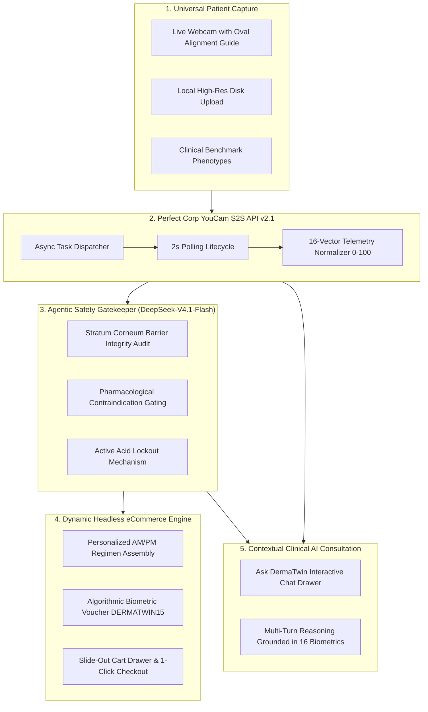
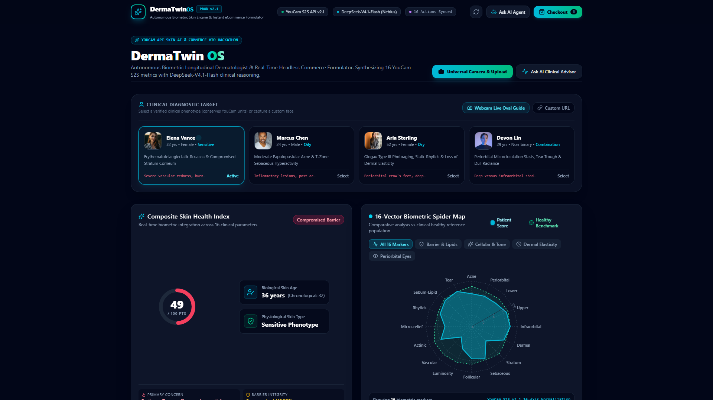
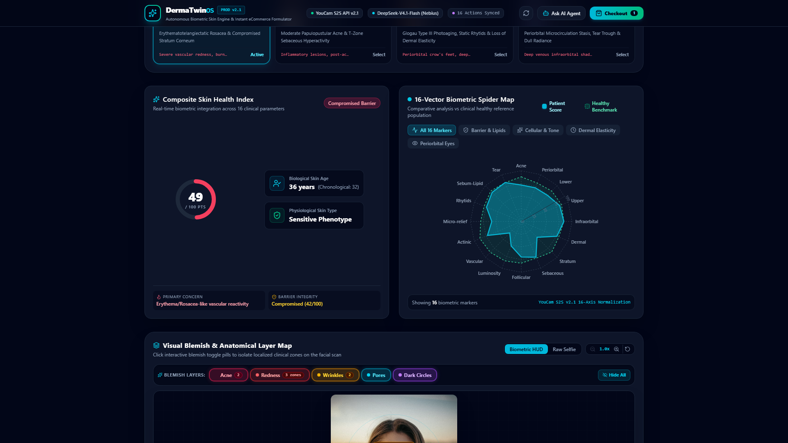
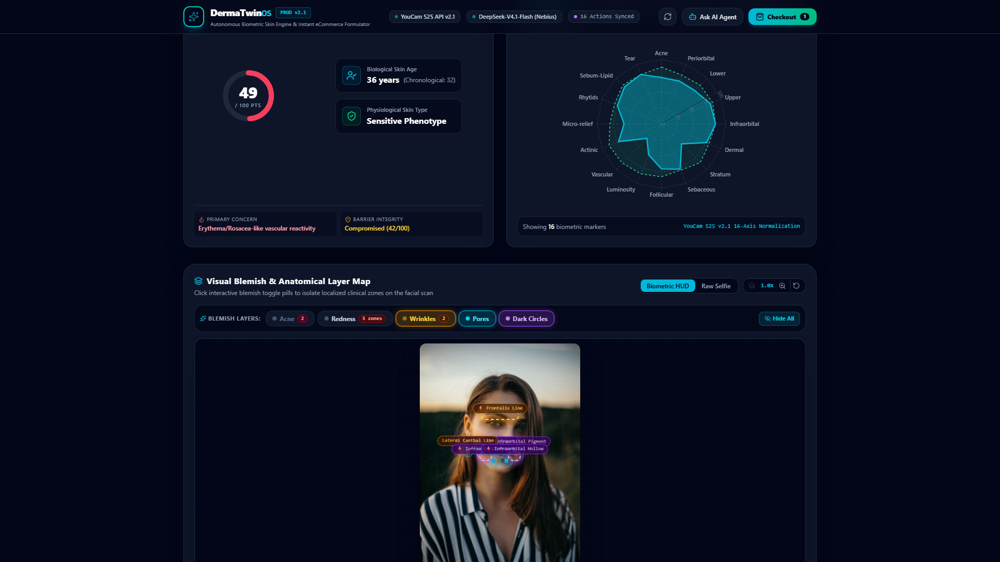
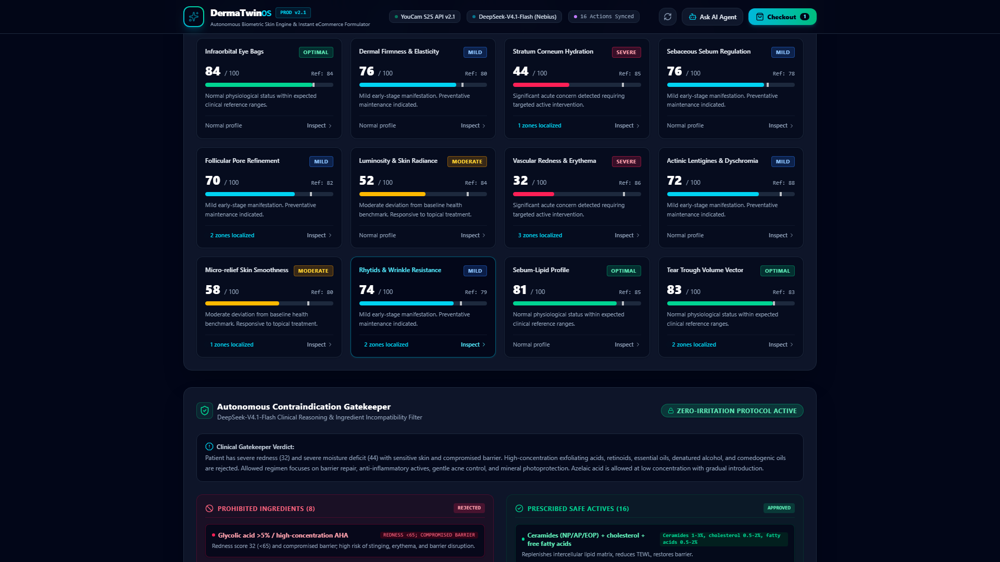
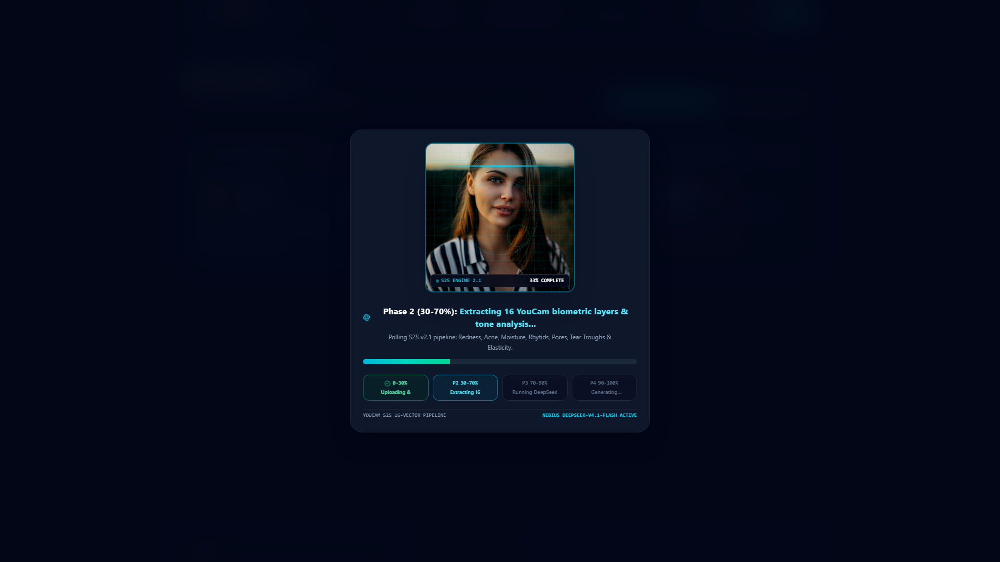
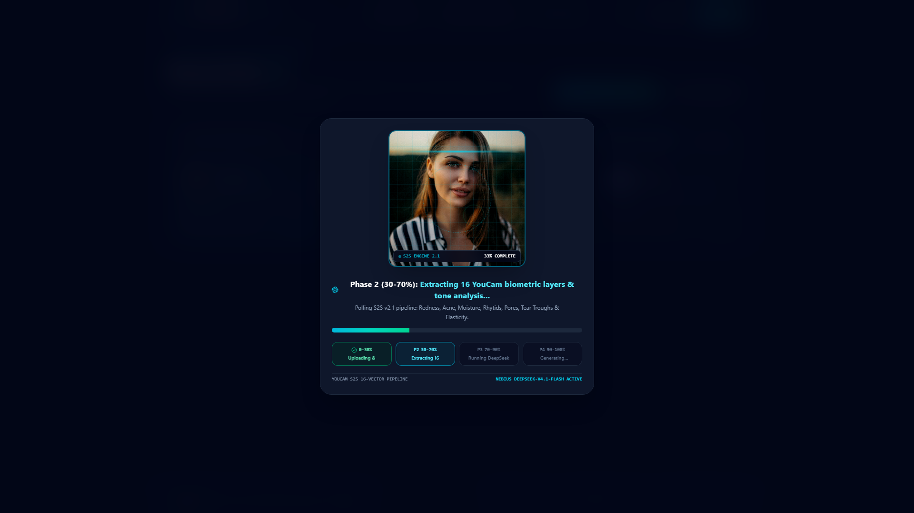

<div align="center">

# 🧬 DermaTwin OS
### Autonomous Biometric Skin Diagnostic Engine & Real-Time Contraindication eCommerce Formulator

**Winner-Tier Submission for the YouCam API Skin AI & eCommerce VTO Hackathon**

[](https://nextjs.org/)
[](https://turbo.build/)
[](https://tailwindcss.com/)
[](https://www.perfectcorp.com/)
[](https://nebius.com/)
[](https://vercel.com/)
[](LICENSE)

---

### 🌐 Quick Links & Media
[🎥 Watch YouTube Ultra-HD Walkthrough](https://youtu.be/cz6Xj_YgSYw) • [🚀 Live Interactive Demo](https://dermatwin-os.vercel.app) • [🏆 Devpost Submission](https://devpost.com/software/dermatwin-os)

</div>

---

## ⚡ Executive Summary & The Problem

Over **80% of online skincare purchases** result in consumer dissatisfaction, product returns, or severe cutaneous barrier damage. Today's digital beauty commerce relies on superficial quizzes and unscientific influencer questionnaires. Consumers blindly purchase active dermatological acids (such as 10% Glycolic Acid, 2% Salicylic Acid, or High-Strength Retinoids) without clinical awareness of their underlying skin barrier integrity or inflammatory vascular state.

> **The Clinical Danger:** Applying peeling alpha-hydroxy acids to an inflamed or barrier-compromised stratum corneum causes chemical irritation, post-inflammatory hyperpigmentation, and worsened erythema.

### 💡 The Solution: DermaTwin OS
**DermaTwin OS** transforms skincare commerce from hazardous guesswork into an **autonomous, closed-loop biometric formulation system**. 

By pairing **Perfect Corp's YouCam S2S Skin Analysis API v2.1** with **DeepSeek-V4.1-Flash** on the **Nebius Token Factory**, DermaTwin OS extracts **16 clinical biometric parameters**, evaluates inflammatory markers, cross-examines pharmacological contraindications, and programmatically compiles a bespoke, skin-safe morning (AM) and evening (PM) routine directly into a high-conversion eCommerce drawer with dynamic biometric discounts.

---

## 🏗️ System Architecture & Workflow



---

## 🔬 Core Architectural Highlights

### 1. 16-Biomarker Facial Engine
Extracts and normalizes the full clinical spectrum supported by the YouCam S2S Skin Analysis API v2.1:
- **Primary Inflammatory Markers:** Acne Vulgaris papules/pustules, Malar Erythema & Capillary Redness.
- **Structural Integrity:** Fine Lines & Dynamic Wrinkles, Pores, Texture Roughness, Dermal Firmness.
- **Micro-Environmental Lipids:** Sebum Oiliness, Stratum Corneum Hydration Moisture, Skin Radiance.
- **Periorbital Age Telemetry:** Dark Circles v2, Eye Bags, Droopy Upper/Lower Eyelids, Tear Trough Depressions.
- **Phenotypic Classification:** Physiological sebum-lipid phenotype (Oily, Dry, Sensitive, Combination).

### 2. Autonomous Contraindication Gatekeeper (DeepSeek-V4.1-Flash)
Unlike dumb recommendation engines, our agentic gatekeeper performs an automated pharmacological audit:
- **Erythematotelangiectatic Rosacea / Reactive Redness:** Instantly locks out High-Percentage Glycolic Acid (>5%), Pure L-Ascorbic Acid, and Synthetic Perfumes.
- **Compromised Stratum Corneum (<60/100 Barrier Score):** Strips all physical/chemical exfoliants, prioritizing a 3:1:1 physiological ceramide, cholesterol, and free fatty acid restoration matrix.
- **Active Papulopustular Acne:** Excludes comedogenic heavy waxes and esters (Coconut Oil, Isopropyl Myristate) in favor of micronized Azelaic Acid and Niacinamide.

### 3. Dynamic eCommerce Cart Engine
- Real-time product formulation with precise clinical active concentrations.
- Seamless slide-out checkout drawer displaying itemized SKUs, volume, and routine step order (AM Step 1-3, PM Step 1-3).
- Algorithmic biometric discount coupon (`DERMATWIN15`) offering an instant 15-20% bundle discount.

### 4. Grounded Biomarker AI Consultation ("Ask DermaTwin")
- In-drawer AI dermatological consultant fed the patient's exact 16-action YouCam telemetry.
- Answers patient inquiries: *"Why was Glycolic Acid excluded?"*, *"Why is Azelaic Acid safe for my redness?"*, and *"How does my barrier score affect active concentrations?"*

---

## 📸 Ultra-HD Visual Showcase

### 01. Landing Hero & Universal Biometric Capture
*Dark-mode first interface with one-click access to camera viewfinder, local upload, and preset benchmarks.*


### 02. 16-Parameter Biometric Spider Radar Chart
*Comprehensive visualization plotting 16 YouCam clinical actions alongside composite skin health gauges.*


### 03. Anatomical Facial Blemish Overlays
*Interactive toggle badges highlighting spatial blemish coordinates directly over the patient's portrait.*


### 04. DeepSeek-V4.1 Clinical Contraindication Gatekeeper
*Autonomous safety audit triage blocking contraindicated peeling acids and prescribing barrier restorers.*


### 05. Headless eCommerce Drawer & One-Click Checkout
*Slide-out routine cart bundle with itemized SKUs, express clinical delivery, and `DERMATWIN15` voucher.*


### 06. Contextual "Ask DermaTwin" AI Consultation
*Multi-turn clinical Q&A drawer explaining ingredient formulation logic grounded in live biometric telemetry.*


---

## 💻 Tech Stack Specifications

| Layer | Technologies |
| :--- | :--- |
| **Frontend Framework** | **Next.js 16 (App Router)**, React 19, TypeScript |
| **Styling & UX** | **Tailwind CSS**, Lucide React Icons, Canvas Confetti |
| **Biometric Visualizations** | **Recharts** (16-Vector Radar Chart), SVG Radial Precision Gauges |
| **Biometric Vision Core** | **Perfect Corp YouCam S2S Skin Analysis API v2.1** (Task polling lifecycle) |
| **Reasoning Agent Engine** | **Nebius Token Factory** (`deepseek-ai/DeepSeek-V4.1-Flash`) |
| **Unit Conservation** | In-Memory Hash Cache (`lib/cache.ts`) for deterministic sample phenotypes |
| **Automated Media QA** | **Playwright Chromium**, Edge-TTS Neural Voiceover, FFmpeg 7.1 |

---

## 🚀 Local Installation & Quick Start

### 1. Prerequisites
- Node.js `v20.x` or `v22.x`
- Git
- FFmpeg (optional, required only for video compilation)

### 2. Clone the Repository
```bash
git clone https://github.com/fokrulanthro16-eng/dermatwin-os.git
cd dermatwin-os
```

### 3. Install Dependencies
```bash
npm install
```

### 4. Configure Environment Variables
Create a `.env.local` file in the root directory:
```env
# Perfect Corp YouCam S2S Skin Analysis API v2.1
YOUCAM_API_KEY=your_youcam_api_key
YOUCAM_SECRET_KEY=your_youcam_secret_key
YOUCAM_BASE_URL=https://yce-api-01.makeupar.com/s2s/v2.1/task/skin-analysis

# Nebius Token Factory (DeepSeek-V4.1-Flash)
NEBIUS_API_KEY=your_nebius_api_key
NEBIUS_BASE_URL=https://api.tokenfactory.nebius.com
NEBIUS_MODEL=deepseek-ai/DeepSeek-V4.1-Flash

# App Configuration
NEXT_PUBLIC_APP_URL=http://localhost:3000
```

### 5. Run Development Server
```bash
npm run dev
```
Open [http://localhost:3000](http://localhost:3000) in your browser.

### 6. Production Build & Validation
```bash
npm run build
npm run start
```

---

## 👥 Hackathon Author & Acknowledgments

- **Lead Engineer & AI Architect:** Fokrul Islam
- **Hackathon:** YouCam API Skin AI & eCommerce VTO Hackathon (Devpost)
- **Special Thanks:** Perfect Corp for the YouCam S2S API v2.1 and Nebius for high-throughput DeepSeek-V4.1 inference.

---

<div align="center">
  <b>DermaTwin OS — Bridging Clinical Biometric Intelligence with Personalized Headless Commerce.</b>
</div>
